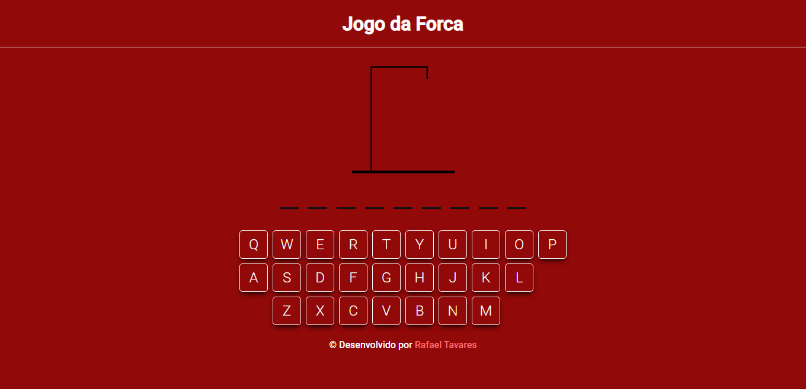
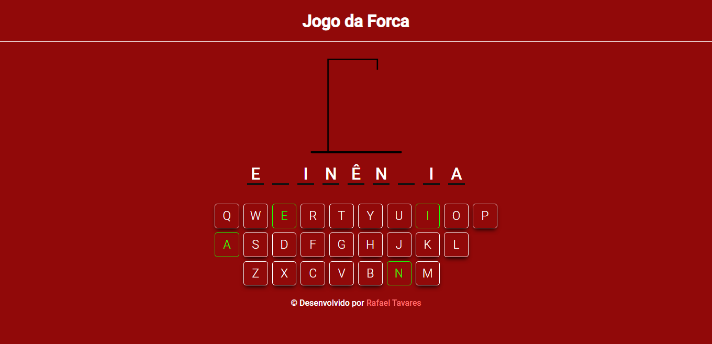
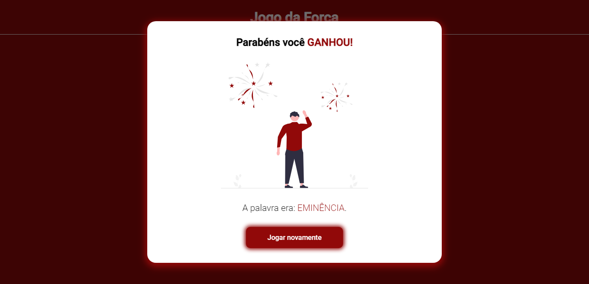

<h1 align="center">Hangman Game</h1>

Este é meu jogo da forca, o segundo desafio do projeto ONE - Oracle Next Education

Sumário
===========
<!--ts-->
  * [Sobre](#sobre)
  * [Screenshot](#screenshot)
  * [Como usar](#como-usar)
  * [Status](#status)
  * [Funcionalidades](#funcionalidades)
  * [Tecnologias](#tecnologias)
  * [Autor](#autor)
<!--te-->

Sobre
-----

Esse projeto é o segundo desafio do projeto ONE - Oracle Next Education, um jogo da forca feito com HTML, CSS e Javascript

Eu sempre gostei desse jogo e foi muito legal poder fazer o meu, estou muito feliz com o resultado achei o site muito bonito e atendeu as minhas expectativas para o projeto.

A princípio eu estava buscando uma API para pegar as palavras, porém não encontrei nenhuma que me atendeu.Então eu encontrei uma lista com mais de 2.000 palavras e fiz um array.

O brilho do programa pra mim está no teclado, construí-lo foi relativamente simples e ficou muito intuitivo e bonito.

Screenshot
----------

Como Usar
---------

Você pode acessar o site clicando <a href="https://github.com/rafatavares03/hangman-game">aqui</a> ou abrindo o arquivo HTML em um navegador.

Logo de início uma palavra será sorteada e você pode tentar descobrir qual é, você possui 6 tentativas para acertar a palavra.

A cada final de jogo será mostrada a palavra correta e você poderá jogar novamente com outra palavra sorteada clicando no botão "Jogar novamente".

Status
------
Concluído :heavy_check_mark:

Funcionalidades
---------------
- [x] Jogar com o teclado
- [x] Jogar com o mouse
- [X] 6 tentativas
- [X] Mais de 2.000 palavras
- [ ] Adicionar palavras

Tecnologias
-----------

  
  
  

Autor
------
<h3 align="center">Rafael Tavares</h3>

 <a href="https://www.facebook.com/rafael.tavares.39904/"></img></a>
 <a href="https://www.instagram.com/rafatavares03/"></img></a>
 <a hrf="https://github.com/rafatavares03"></img></a>
  <a hrf="https://www.linkedin.com/in/rafatavares03-dev/"></img></a>

